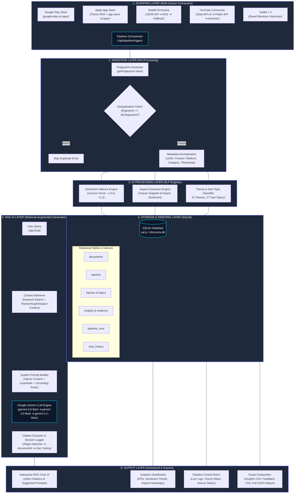

# 🚀 Discovery Engine AI: Multi-Channel Product Intelligence & RAG Feedback Pipeline


**Discovery Engine AI** is an end-to-end, multi-source product intelligence and feedback processing pipeline built for e-commerce and quick-commerce platforms. It automatically harvests user reviews and social mentions from 5 major digital channels, deduplicates and cleanses incoming data, runs automated natural language processing (sentiment, aspect extraction, and strategic theme classification), indexes records in a relational database, and provides a Retrieval-Augmented Generation (RAG) conversational assistant powered by Google Gemini.

---

## 📑 Table of Contents

- [Architectural Overview](#-architectural-overview)
- [System Layers & Data Workflow](#-system-layers--data-workflow)
- [Key Features](#-key-features)
- [Tech Stack](#-tech-stack)
- [Database Schema](#-database-schema)
- [Getting Started](#-getting-started)
- [Environment Variables](#-environment-variables)
- [API Reference](#-api-reference)
- [Data Export & Intelligence Reports](#-data-export--intelligence-reports)
- [Deployment](#-deployment)

---

## 🏗️ Architectural Overview

The application follows a modular, decoupled 6-layer architecture separating data acquisition, ingestion preprocessing, natural language processing, relational storage, RAG AI execution, and interactive analytics.



---

## ⚙️ System Layers & Data Workflow

### 1. Scraping Layer
Harvests raw customer reviews, social posts, and comments across 5 public channels:
* **Google Play Store**: Uses `google-play-scraper` to pull app reviews for target services (`Blinkit`, `Zepto`, `Swiggy Instamart`, `BigBasket`, `JioMart`).
* **Apple App Store**: Fetches reviews from iTunes Customer Reviews RSS API (`https://itunes.apple.com/in/rss/customerreviews/...`) with `app-store-scraper` fallback.
* **Reddit**: 3-tier cascade (*Reddit JSON API* $\rightarrow$ *Reddit RSS Feed XML Parser* $\rightarrow$ *Synthetic Ingestion Engine*).
* **YouTube Comments**: 3-tier cascade (*YouTube Data API v3* $\rightarrow$ *Public Video Comment APIs* $\rightarrow$ *Dynamic Ingestor*). Accepts custom video URLs.
* **Twitter / X**: Scrapes brand mention feedback for target handles (`@Blinkit`, `@ZeptoNow`, `@SwiggyInstamart`).

### 2. Ingestion & Pre-Processing Layer
* **Fingerprint Deduplication (`getFingerprint`)**: Lowercases text, strips punctuation/symbols, and calculates a hash identifier (`fp_<hex>`). Prevents identical reviews from being stored or analyzed multiple times.
* **Metadata Normalization**: Assigns a unique UUID (`docId`), standardizes platform tags (`Android`, `iOS`, `Web`), product names, product categories, and timestamps.

### 3. AI Processing Layer (NLP Pipeline)
* **Sentiment Valence Engine (`analyzeSentiment`)**: Matches tokens against positive/negative lexicons to calculate continuous valence:
  $$V = \frac{\text{posCount} - \text{negCount}}{\text{posCount} + \text{negCount}} \in [-1.0, +1.0]$$
  Assigns categorical labels (`positive`, `negative`, `neutral`, `mixed`).
* **Aspect Extraction Engine (`extractAspects`)**: Splits documents into syntactic clauses using punctuation delimiters and tags aspect domains (`delivery`, `product quality`, `reordering`, `pricing`, `recommendations`, `features`).
* **Theme & Topic Classifier (`findThemeId`, `findTopicId`)**: Maps feedback into **9 Strategic Themes** (e.g., *Habitual Reordering*, *Routine & Convenience*, *Pricing & Value Perception*) and **27 Sub-Topics**.

### 4. Storage & Indexing Layer
* Powered by `sql.js` (WebAssembly-backed SQLite saved to `server/data/discovery.db`).
* B-Tree indexes created on `source`, `sentiment_label`, `theme_id`, `topic_id`, `created_at`, `category`, `document_id` (aspects), `insight_id` (evidence), and `session_id` (chat).

### 5. RAG AI Layer (Retrieval-Augmented Generation)
* **Context Retrieval**: Tokenizes user questions and queries matching document snippets along with macro metrics, aspect mentions, and strategic insights.
* **Google Gemini LLM Engine**: Connects to the official Google Gemini API using a multi-model fallback cascade (`gemini-3.6-flash` $\rightarrow$ `gemini-3.5-flash-lite` $\rightarrow$ `gemini-3.1-flash-lite`).
* **Grounding & Guardrails**: Enforces domain boundaries (User Feedback Intelligence), prevents prompt injection, and generates inline citations (`[Source: platform, date]`).

### 6. Output & Analytics Layer
* **Dashboard UI**: Real-time KPIs, sentiment distribution pie charts, trend line charts, aspect sentiment heatmaps, and segment profiles.
* **Pipeline Control Room**: Live status monitoring, error rate indicators, 48-hour hourly ingestion rate chart, and manual execution triggers.
* **Export Subsystem**: One-click exports for Strategic Insights (CSV), Collected Documents (CSV), and Full System Intelligence Reports (JSON).

---

## ✨ Key Features

- 🔄 **Multi-Source Scraping**: Automated data collection across Google Play, Apple App Store, Reddit, YouTube, and Twitter.
- 🎯 **Fingerprint Deduplication**: Fast hash-based check ensuring duplicate reviews are filtered out before DB storage.
- 📊 **Lexicon & Clause NLP**: Sentiment valence scoring and clause-based snippet aspect extraction.
- 🤖 **Gemini-Powered RAG Chat**: Natural language interface to ask strategic questions about user feedback with grounded inline citations.
- 📺 **Custom YouTube Video Analyzer**: Input any YouTube video URL to scrape and analyze public comment sentiment on demand.
- 📥 **Multi-Format Data Exports**: Download raw feedback or strategic insight reports as CSV or JSON.

---

## 🛠️ Tech Stack

### Backend
- **Runtime**: Node.js (v18+)
- **Framework**: Express.js
- **Language**: TypeScript
- **Database**: SQLite via `sql.js` (WASM)
- **Scrapers**: `google-play-scraper`, `app-store-scraper`, Fetch API / RSS Parsers
- **Utilities**: `uuid`, `cors`

### AI & NLP
- **LLM Engine**: Google Gemini API (`gemini-3.6-flash`)
- **NLP Algorithms**: Lexicon sentiment valence scoring, clause-level aspect extraction, theme keyword mapping

### Frontend
- **Framework**: React 18
- **Build Tool**: Vite
- **Styling**: Modern Vanilla CSS (Dark Glassmorphism UI)
- **Icons & Charts**: Lucide Icons, Recharts

---

## 🗄️ Database Schema

```sql
CREATE TABLE themes (
  id INTEGER PRIMARY KEY AUTOINCREMENT,
  name TEXT NOT NULL,
  description TEXT,
  topic_count INTEGER DEFAULT 0,
  document_count INTEGER DEFAULT 0,
  avg_sentiment REAL DEFAULT 0,
  last_updated TEXT DEFAULT (datetime('now'))
);

CREATE TABLE topics (
  id INTEGER PRIMARY KEY AUTOINCREMENT,
  label TEXT NOT NULL,
  keywords TEXT NOT NULL,
  document_count INTEGER DEFAULT 0,
  theme_id INTEGER REFERENCES themes(id),
  trend_data TEXT,
  last_updated TEXT DEFAULT (datetime('now'))
);

CREATE TABLE documents (
  id TEXT PRIMARY KEY,
  source TEXT NOT NULL,
  source_id TEXT,
  content TEXT NOT NULL,
  title TEXT,
  rating INTEGER,
  author TEXT,
  author_meta TEXT,
  language TEXT DEFAULT 'en',
  category TEXT,
  product TEXT,
  platform TEXT,
  sentiment_valence REAL,
  sentiment_label TEXT,
  sentiment_confidence REAL,
  topic_id INTEGER REFERENCES topics(id),
  theme_id INTEGER REFERENCES themes(id),
  created_at TEXT NOT NULL,
  ingested_at TEXT DEFAULT (datetime('now')),
  fingerprint TEXT
);

CREATE TABLE aspects (
  id TEXT PRIMARY KEY,
  document_id TEXT NOT NULL REFERENCES documents(id),
  aspect_name TEXT NOT NULL,
  sentiment TEXT NOT NULL,
  snippet TEXT,
  confidence REAL DEFAULT 0.8
);

CREATE TABLE insights (
  id TEXT PRIMARY KEY,
  theme_id INTEGER REFERENCES themes(id),
  insight_text TEXT NOT NULL,
  recommendation TEXT,
  confidence REAL DEFAULT 0.8,
  actionability TEXT DEFAULT 'medium',
  user_segments TEXT,
  strategic_question TEXT,
  validation_status TEXT DEFAULT 'validated',
  source_types TEXT,
  evidence_count INTEGER DEFAULT 0,
  generated_at TEXT DEFAULT (datetime('now'))
);

CREATE TABLE evidence (
  id TEXT PRIMARY KEY,
  insight_id TEXT NOT NULL REFERENCES insights(id),
  document_id TEXT NOT NULL REFERENCES documents(id),
  quote TEXT NOT NULL,
  source TEXT NOT NULL
);

CREATE TABLE chat_history (
  id TEXT PRIMARY KEY,
  session_id TEXT NOT NULL,
  role TEXT NOT NULL,
  content TEXT NOT NULL,
  citations TEXT,
  created_at TEXT DEFAULT (datetime('now'))
);

CREATE TABLE pipeline_runs (
  id TEXT PRIMARY KEY,
  source TEXT NOT NULL,
  status TEXT NOT NULL,
  documents_fetched INTEGER DEFAULT 0,
  documents_processed INTEGER DEFAULT 0,
  errors INTEGER DEFAULT 0,
  started_at TEXT DEFAULT (datetime('now')),
  completed_at TEXT,
  log TEXT
);
```

---

## 🚀 Getting Started

### Prerequisites
- **Node.js**: v18.0.0 or higher
- **npm**: v9.0.0 or higher

### Installation

1. **Clone the repository**:
   ```bash
   git clone https://github.com/SashankR117/NXTGRADPROJECT.git
   cd NXTGRADPROJECT
   ```

2. **Install Root Dependencies**:
   ```bash
   npm install
   ```

3. **Install Client & Server Dependencies**:
   ```bash
   cd server && npm install
   cd ../client && npm install
   cd ..
   ```

4. **Configure Environment Variables**:
   Create a `.env` file in the project root:
   ```env
   PORT=3001
   GEMINI_API_KEY=your_google_gemini_api_key_here
   YOUTUBE_API_KEY=optional_youtube_data_api_key_here
   ```

5. **Start the Development Server**:
   From the project root:
   ```bash
   npm run dev
   ```
   * The API server will run at `http://localhost:3001`
   * The React UI will run at `http://localhost:5173`

6. **Auto-Seeding**:
   If `server/data/discovery.db` does not exist, the server will automatically seed the initial dataset on first boot.

---

## 🔑 Environment Variables

| Variable | Required | Description |
| :--- | :--- | :--- |
| `PORT` | Optional | Port for Express API server (default: `3001`) |
| `GEMINI_API_KEY` | **Required for RAG Chat** | Google Gemini API Key for LLM query responses |
| `YOUTUBE_API_KEY` | Optional | Official YouTube Data API v3 key for YouTube comment scraping |

---

## 📡 API Reference

### Dashboard Endpoints
- `GET /api/dashboard/overview`: Fetches KPI summary, sentiment distributions, top themes, and aspect heatmaps.
- `GET /api/dashboard/themes`: Returns all themes and sub-topics.
- `GET /api/dashboard/themes/:id`: Fetches detailed documents, topics, and trend metrics for a specific theme.
- `GET /api/dashboard/insights`: Returns strategic insights filterable by question, confidence, and actionability.
- `GET /api/dashboard/sources`: Returns volume and sentiment metrics grouped by source channel.
- `GET /api/dashboard/explorer`: Searchable document endpoint with pagination and multi-field filtering.
- `GET /api/dashboard/trends`: Returns theme timeline trends and emerging topic shifts.
- `GET /api/dashboard/segments`: Returns target user segment profiles.
- `GET /api/dashboard/aspects`: Aggregated aspect mentions and confidence scores.

### Pipeline Endpoints
- `GET /api/pipeline/status`: Returns current pipeline execution runs, document counts, and 48h ingestion rates.
- `POST /api/pipeline/trigger`: Triggers live scraping across all 5 channels in parallel.
- `POST /api/pipeline/trigger-youtube`: Triggers YouTube comment scraping for a specific video URL.
- `POST /api/pipeline/trigger-playstore`: Triggers Play Store review scraping.
- `POST /api/pipeline/trigger-appstore`: Triggers App Store review scraping.
- `POST /api/pipeline/trigger-twitter`: Triggers Twitter feedback scraping.

### Chat & RAG Endpoints
- `POST /api/chat`: Submits user prompt to context retriever and Google Gemini LLM. Returns response with citations.
- `GET /api/chat/history?sessionId=<id>`: Retrieves conversation transcript for a session.
- `GET /api/chat/suggestions`: Returns recommended sample questions.

---

## 📤 Data Export & Intelligence Reports

- **Export Insights CSV**: `GET /api/dashboard/export/insights`
- **Export Documents CSV**: `GET /api/dashboard/export/documents`
- **Export Full Report JSON**: `GET /api/dashboard/export/full-report`

---

## 📄 License

This project is licensed under the MIT License.
